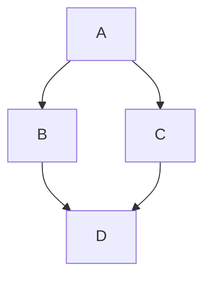

# @docmd/plugin-mermaid

Adds [Mermaid.js](https://mermaid.js.org/) diagram support to **docmd**.

## Usage
Use the `mermaid` code fence in your Markdown:

````

````

## The docmd Ecosystem

`docmd` is a modular system. Here are the official packages:

**The Engine**
*   [**@docmd/core**](https://www.npmjs.com/package/@docmd/core) - The CLI runner and build orchestrator.
*   [**@docmd/parser**](https://www.npmjs.com/package/@docmd/parser) - The pure Markdown-to-HTML logic.
*   [**@docmd/live**](https://www.npmjs.com/package/@docmd/live) - The browser-based Live Editor bundle.

**Interface & Design**
*   [**@docmd/ui**](https://www.npmjs.com/package/@docmd/ui) - Base EJS templates and assets.
*   [**@docmd/themes**](https://www.npmjs.com/package/@docmd/themes) - Official themes (Sky, Ruby, Retro).

**Plugins**
*   [**@docmd/plugin-search**](https://www.npmjs.com/package/@docmd/plugin-search) - Offline full-text search.
*   [**@docmd/plugin-mermaid**](https://www.npmjs.com/package/@docmd/plugin-mermaid) - Diagrams and flowcharts.
*   [**@docmd/plugin-seo**](https://www.npmjs.com/package/@docmd/plugin-seo) - Meta tags and Open Graph data.
*   [**@docmd/plugin-sitemap**](https://www.npmjs.com/package/@docmd/plugin-sitemap) - Automatic sitemap generation.
*   [**@docmd/plugin-llms**](https://www.npmjs.com/package/@docmd/plugin-llms) - AI context generation.
*   [**@docmd/plugin-analytics**](https://www.npmjs.com/package/@docmd/plugin-analytics) - Google Analytics integration.

## License

Distributed under the MIT License. See `LICENSE` for more information.