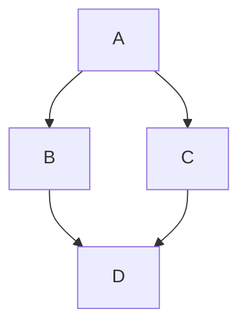

# @docmd/plugin-mermaid

Adds [Mermaid.js](https://mermaid.js.org/) diagram support to **docmd**.

## Usage
Use the `mermaid` code fence in your Markdown:

````

```mermaid
graph TD;
    A-->B;
    A-->C;
    B-->D;
    C-->D;
```
````